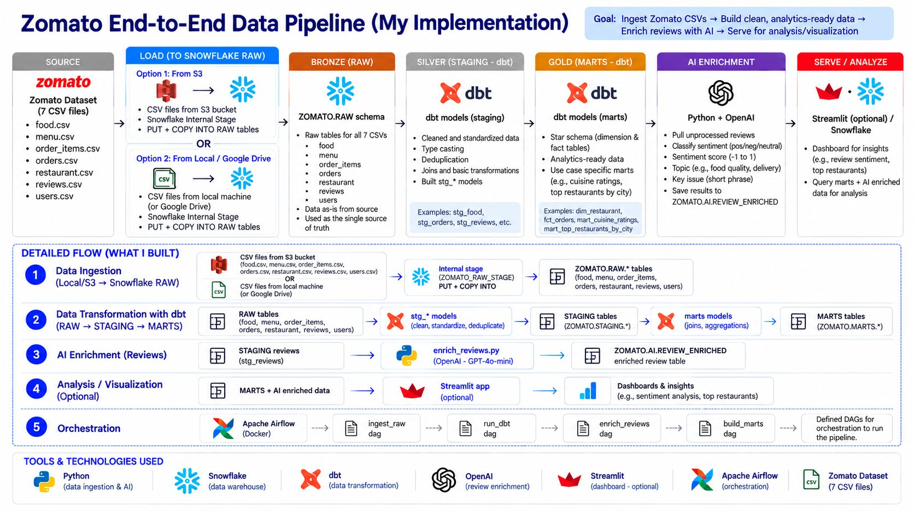

# Zomato End-to-End Data Engineering & AI Analytics Pipeline

An end-to-end data engineering project that ingests raw food-delivery data into **Snowflake**, transforms it into analytics-ready dimensional models using **dbt**, orchestrates pipeline workflows with **Apache Airflow**, and builds AI-powered analytics applications using **OpenAI and Streamlit**.

The project demonstrates a complete modern data workflow — from **raw CSV ingestion → data warehouse modelling → transformation → business marts → orchestration → AI enrichment → natural-language analytics**.

---

## Architecture



### High-Level Data Flow

```text
Raw Zomato CSV Data
        │
        ▼
Snowflake Internal Stage
        │
        │ COPY INTO
        ▼
┌──────────────────────┐
│    Snowflake RAW     │
└──────────┬───────────┘
           │
           │ dbt
           ▼
┌──────────────────────┐
│   STAGING / SILVER   │
│ Cleaning + Typing    │
└──────────┬───────────┘
           │
           │ dbt
           ▼
┌──────────────────────┐
│     MARTS / GOLD     │
│ Facts + Dimensions   │
│ Business Data Marts  │
└──────────┬───────────┘
           │
           ├──────────────► Business Analytics
           │
           ├──────────────► Text-to-SQL Application
           │
           └──────────────► AI / RAG Applications

Pipeline Orchestration: Apache Airflow
Local Infrastructure: Docker + PostgreSQL
```

---

## Project Highlights

| Area                       | Implementation                                                                                    |
| -------------------------- | ------------------------------------------------------------------------------------------------- |
| **Data Ingestion**         | Loaded 7 raw food delivery datasets into Snowflake through a named internal stage and `COPY INTO` |
| **Data Warehouse**         | Designed RAW, STAGING, MARTS and AI layers in Snowflake                                           |
| **Transformation**         | Built modular dbt staging, dimensional and business mart models                                   |
| **Data Modelling**         | Created fact and dimension models for orders, customers and restaurants                           |
| **Incremental Processing** | Implemented incremental `FACT_ORDERS` using dbt merge strategy                                    |
| **Analytics Marts**        | Built reusable models for revenue, restaurant performance and delivery SLA analysis               |
| **Data Quality**           | Added dbt tests and validation rules for transformed datasets                                     |
| **Orchestration**          | Created an Apache Airflow DAG to coordinate ingestion, dbt and AI workloads                       |
| **AI Enrichment**          | Enriched customer reviews with sentiment, topic and key-issue classifications using OpenAI        |
| **RAG**                    | Built semantic retrieval over customer reviews using embeddings and cosine similarity             |
| **Text-to-SQL**            | Built an application that converts natural-language business questions into Snowflake SQL         |
| **Visualization**          | Displayed query results and charts through Streamlit                                              |
| **Containerization**       | Configured a local Airflow environment using Docker Compose and PostgreSQL                        |

---

# Tech Stack

| Category              | Technologies                    |
| --------------------- | ------------------------------- |
| **Data Warehouse**    | Snowflake                       |
| **Transformation**    | dbt                             |
| **Languages**         | SQL, Python                     |
| **Orchestration**     | Apache Airflow                  |
| **Containerization**  | Docker, Docker Compose          |
| **Metadata Database** | PostgreSQL                      |
| **AI / LLM**          | OpenAI API, GPT-4o-mini         |
| **Embeddings**        | OpenAI `text-embedding-3-small` |
| **Application Layer** | Streamlit                       |
| **Data Processing**   | pandas, NumPy                   |
| **Version Control**   | Git, GitHub                     |

---

# Dataset

The pipeline processes seven food-delivery datasets covering customers, restaurants, menus, orders and reviews.

| Dataset           | Purpose                                 |
| ----------------- | --------------------------------------- |
| `users.csv`       | Customer information                    |
| `restaurant.csv`  | Restaurant attributes                   |
| `food.csv`        | Food item information                   |
| `menu.csv`        | Restaurant menu data                    |
| `orders.csv`      | Order-level transactional data          |
| `order_items.csv` | Individual items associated with orders |
| `reviews.csv`     | Customer ratings and review comments    |

Large transactional datasets were split into manageable chunks before loading where necessary.

---

# Data Warehouse Architecture

The Snowflake environment is organized into multiple logical layers.

| Layer         | Purpose                                                           |
| ------------- | ----------------------------------------------------------------- |
| **RAW**       | Stores source data with minimal transformation                    |
| **STAGING**   | Cleans, standardizes and prepares raw data                        |
| **MARTS**     | Contains dimensional models and analytics-ready business datasets |
| **SNAPSHOTS** | Supports historical tracking where applicable                     |
| **AI**        | Stores AI-enriched outputs such as review classifications         |

This separation keeps ingestion, transformation, analytics and AI workloads logically isolated.

---

# 1. Data Ingestion

Raw CSV files are first uploaded to a Snowflake named internal stage.

```text
Local CSV Files
       │
       │ PUT
       ▼
ZOMATO_RAW_STAGE
       │
       │ COPY INTO
       ▼
Snowflake RAW Tables
```

The stage provides an intermediate location between local source files and Snowflake tables.

### Raw Tables

The RAW layer contains source-aligned tables for:

```text
USERS
RESTAURANTS
FOOD
MENU
ORDERS
ORDER_ITEMS
REVIEWS
```

The ingestion process intentionally keeps the RAW layer close to the source representation. Cleaning, casting and business transformations are handled downstream through dbt.

---

# 2. dbt Transformation Layer

dbt manages the transformation workflow inside Snowflake.

```text
Snowflake RAW
      │
      │ source()
      ▼
dbt Staging Models
      │
      │ ref()
      ▼
Fact + Dimension Models
      │
      ▼
Business Data Marts
```

Using dbt provides:

- Modular SQL transformations
- Dependency management using `ref()`
- Source definitions using `source()`
- Automated DAG lineage
- Data testing
- Incremental model processing
- Documentation
- Reusable analytics models

---

## Staging Layer

Staging models clean and standardize source data before it reaches the analytical layer.

Examples of transformations include:

- Standardizing column names
- Renaming source identifiers
- Cleaning city values
- Handling null values
- Creating derived fields
- Standardizing data types
- Creating delivery indicators
- Preparing dimensions and facts

For example, the orders staging model converts source fields into business-friendly fields such as:

```sql
user_id AS customer_id
r_id AS restaurant_id
```

and derives:

```sql
(order_status = 'Delivered') AS is_delivered
```

This keeps source-specific logic out of downstream business models.

---

# 3. Dimensional Data Model

The MARTS layer converts cleaned data into analytics-ready fact and dimension models.

### Core Models

| Model            | Type      | Purpose                                     |
| ---------------- | --------- | ------------------------------------------- |
| `FACT_ORDERS`    | Fact      | Order-level transactional metrics           |
| `DIM_CUSTOMER`   | Dimension | Customer attributes and segmentation        |
| `DIM_RESTAURANT` | Dimension | Restaurant, location and cuisine attributes |

Conceptually:

```text
              DIM_CUSTOMER
                    │
                    │ customer_id
                    ▼
             ┌─────────────┐
             │ FACT_ORDERS │
             └─────────────┘
                    ▲
                    │ restaurant_id
                    │
             DIM_RESTAURANT
```

This structure separates measurable business events from descriptive attributes and makes analytical queries easier to maintain.

---

## FACT_ORDERS

`FACT_ORDERS` represents order-level transactions.

Important fields include:

| Category                | Example Fields                                                |
| ----------------------- | ------------------------------------------------------------- |
| **Keys**                | `order_id`, `customer_id`, `restaurant_id`                    |
| **Time**                | `order_timestamp`, `order_date`                               |
| **Location**            | `city`                                                        |
| **Product**             | `cuisine`                                                     |
| **Financial**           | `subtotal`, `discount`, `delivery_fee`, `gst`, `sales_amount` |
| **Operational**         | `order_status`, `is_delivered`, `delivery_time_min`           |
| **Customer Experience** | `customer_rating`                                             |

---

# 4. Incremental Processing

Rather than rebuilding the entire order fact table on every run, `FACT_ORDERS` is implemented as a **dbt incremental model**.

```sql
{{ config(
    materialized='incremental',
    unique_key='order_id',
    incremental_strategy='merge'
) }}
```

During incremental runs, only records newer than the latest processed order timestamp are selected.

Conceptually:

```text
Existing FACT_ORDERS
        +
New STG_ORDERS records
        │
        ▼
   dbt MERGE
        │
        ▼
Updated FACT_ORDERS
```

This design demonstrates how larger transactional pipelines can avoid unnecessary full-table rebuilds as data volume grows.

---

# 5. Business Analytics Marts

Reusable business marts sit on top of the dimensional layer.

Instead of requiring analysts or applications to repeatedly reconstruct business logic from raw tables, common metrics are calculated once and exposed through dedicated models.

### Daily City Revenue

`MART_DAILY_CITY_REVENUE` provides city-level daily performance.

Metrics include:

| Metric             | Description                             |
| ------------------ | --------------------------------------- |
| `orders`           | Total number of orders                  |
| `delivered_orders` | Successfully delivered orders           |
| `cancel_rate`      | Percentage/rate of cancelled orders     |
| `gmv`              | Revenue generated from delivered orders |
| `aov`              | Average order value                     |

GMV is calculated using delivered orders, keeping the business definition consistent across downstream analysis.

### Additional Analytical Marts

The project also supports analytical datasets such as:

**Restaurant Performance**

- Orders
- Revenue
- Average customer rating
- Cancellation rate
- Cuisine
- City

**Delivery SLA**

- Delivered orders
- Delivery-time metrics
- Late-delivery rate
- City and hour-level analysis

---

# 6. Data Quality

Data quality checks are incorporated into the dbt workflow rather than being treated as a separate manual step.

Tests validate assumptions about transformed datasets, including areas such as:

- Primary identifiers
- Null values
- Relationships between fact and dimension models
- Accepted values
- Referential integrity

A relationship test, for example, can ensure that a customer identifier appearing in an order exists in the corresponding customer dimension.

```text
FACT_ORDERS.customer_id
          │
          ▼
     Relationship Test
          │
          ▼
DIM_CUSTOMER.customer_id
```

A dbt test succeeds when the validation query returns **zero invalid rows**.

---

# 7. AI Review Enrichment

The project extends the traditional data pipeline with an AI enrichment workflow.

Customer reviews stored in Snowflake are sent to OpenAI and converted into structured analytical attributes.

### Enrichment Output

| Field             | Description                                    |
| ----------------- | ---------------------------------------------- |
| `REVIEW_ID`       | Original review identifier                     |
| `SENTIMENT_LABEL` | Positive, negative or neutral                  |
| `SENTIMENT_SCORE` | Sentiment score between -1 and 1               |
| `TOPIC`           | Main review topic                              |
| `KEY_ISSUE`       | Concise description of the main customer issue |
| `MODEL`           | Model used for enrichment                      |
| `ENRICHED_AT`     | Enrichment timestamp                           |

Topics are classified into categories such as:

```text
food quality
delivery
pricing
service
packaging
other
```

### AI Enrichment Flow

```text
ZOMATO.RAW.REVIEWS
        │
        ▼
Select Unprocessed Reviews
        │
        ▼
Python Enrichment Pipeline
        │
        ▼
GPT-4o-mini
        │
        ▼
Structured JSON
        │
        ▼
ZOMATO.AI.REVIEW_ENRICHED
```

Previously enriched `REVIEW_ID`s are excluded, preventing the same reviews from being repeatedly processed.

This turns unstructured review text into structured attributes that can be analyzed using SQL and downstream BI tools.

---

# 8. Retrieval-Augmented Generation (RAG)

The project also includes a RAG-based application for asking questions directly against customer review content.

Instead of sending every review to the LLM, the application retrieves only reviews that are semantically relevant to the user's question.

### RAG Pipeline

```text
Snowflake STG_REVIEWS
        │
        ▼
Sample Review Comments
        │
        ▼
text-embedding-3-small
        │
        ▼
Review Embeddings
        │
        ▼
Local Parquet Cache
        │

User Question
        │
        ▼
Question Embedding
        │
        ▼
Cosine Similarity
        │
        ▼
Top-K Relevant Reviews
        │
        ▼
GPT-4o-mini
        │
        ▼
Grounded Answer
        │
        ▼
Streamlit
```

### Retrieval Process

The application:

1. Retrieves review data from Snowflake.
2. Converts review comments into embedding vectors.
3. Caches generated embeddings in Parquet to avoid unnecessary repeated API calls.
4. Converts the user's question into an embedding.
5. Calculates cosine similarity between the question and review vectors.
6. Selects the most relevant reviews.
7. Adds those reviews as context for the LLM.
8. Generates an answer using only the retrieved review evidence.

The Streamlit interface also exposes the retrieved reviews used to generate the response.

This makes the answer more transparent and grounds generation in actual customer feedback.

---

# 9. Natural-Language-to-SQL Analytics

A second AI application allows non-technical users to query analytical datasets using plain English.

For example:

```text
Top 10 cities by GMV
```

The application provides the Snowflake schema to GPT and asks the model to generate a query.

Example output:

```sql
SELECT
    city,
    SUM(gmv) AS total_gmv
FROM MART_DAILY_CITY_REVENUE
GROUP BY city
ORDER BY total_gmv DESC
LIMIT 10
```

### Text-to-SQL Flow

```text
Business Question
       │
       ▼
Schema-Aware Prompt
       │
       ▼
GPT-4o-mini
       │
       ▼
Generated SQL
       │
       ▼
Safety Validation
       │
       ▼
Snowflake MARTS
       │
       ▼
Pandas DataFrame
       │
       ├────────► Table
       │
       └────────► Chart
                       │
                       ▼
                    Streamlit
```

---

## SQL Safety Layer

Generated SQL is validated before execution.

The application only permits queries beginning with:

```text
SELECT
WITH
```

and blocks data-changing operations such as:

```text
DROP
DELETE
TRUNCATE
ALTER
UPDATE
INSERT
CREATE
REPLACE
GRANT
REVOKE
```

The system prompt also instructs the model to:

- Generate one SELECT query
- Use known analytical tables
- Avoid modifying data
- Limit results to 100 rows where appropriate
- Prefer pre-built MART models when they answer the question

This separates **LLM generation** from **database execution** instead of blindly executing model output.

---

# 10. Streamlit Applications

Streamlit provides the interaction layer for the AI features.

### Review RAG Application

Users can ask questions such as:

```text
What are the most common complaints about delivery?
```

The interface displays:

- Generated answer
- Relevant retrieved reviews
- City
- Rating
- Review text

### Text-to-SQL Application

Users can ask analytical questions such as:

```text
Top 10 cities by GMV

Which cuisine has the most orders?

Average delivery time by city, worst first

Cancellation rate by payment method
```

The interface displays:

1. Generated SQL
2. Snowflake query results
3. Number of rows returned
4. A visualization when the result is suitable for charting

---

# 11. Apache Airflow Orchestration

Apache Airflow coordinates the major pipeline stages.

The `zomato_batch` DAG is configured with a daily schedule.

### DAG Flow

```text
reload_raw
     │
     ▼
dbt_build_core
     │
     ▼
enrich_reviews
     │
     ▼
dbt_build_ai
```

| Airflow Task     | Responsibility                                             |
| ---------------- | ---------------------------------------------------------- |
| `reload_raw`     | Executes Snowflake `COPY INTO` commands for RAW datasets   |
| `dbt_build_core` | Builds core dbt models while excluding AI-dependent models |
| `enrich_reviews` | Runs the Python/OpenAI review enrichment process           |
| `dbt_build_ai`   | Builds models that depend on AI-enriched data              |

This defines explicit dependencies between ingestion, transformation and AI processing.

---

# 12. Dockerized Airflow Environment

The Airflow environment is defined with Docker Compose.

### Services

| Service         | Responsibility                                     |
| --------------- | -------------------------------------------------- |
| `postgres`      | Stores Airflow metadata                            |
| `airflow-init`  | Initializes the Airflow metadata database and user |
| `apiserver`     | Hosts the Airflow 3 API/UI service                 |
| `scheduler`     | Determines when tasks should execute               |
| `dag-processor` | Parses and processes DAG definitions               |

The environment uses Airflow's `LocalExecutor`.

### Mounted Components

Docker volumes/bind mounts expose:

```text
Airflow DAGs
Airflow logs
dbt project
AI Python scripts
PostgreSQL metadata
```

This keeps orchestration infrastructure reproducible and separates it from the host environment.

---

# Project Structure

```text
Zomato-End-to-End-Data-Pipeline/
│
├── ai/
│   ├── enrich_reviews.py
│   ├── rag_chat.py
│   └── text_to_sql.py
│
├── airflow/
│   ├── dags/
│   │   └── zomato_batch.py
│   ├── Dockerfile
│   └── docker-compose.yaml
│
├── docs/
│   └── project screenshots / architecture
│
├── snowflake/
│   └── Snowflake setup and ingestion SQL
│
├── zomato/
│   ├── analyses/
│   ├── macros/
│   ├── models/
│   │   ├── staging/
│   │   └── marts/
│   ├── seeds/
│   ├── snapshots/
│   ├── tests/
│   └── dbt_project.yml
│
├── .gitignore
└── README.md
```

---

# End-to-End Pipeline

| Stage                 | Input              | Processing                       | Output                           |
| --------------------- | ------------------ | -------------------------------- | -------------------------------- |
| **1. Ingestion**      | Raw CSV files      | Snowflake stage + `COPY INTO`    | RAW tables                       |
| **2. Staging**        | RAW tables         | dbt cleaning and standardization | STAGING views                    |
| **3. Modelling**      | STAGING models     | dbt dimensional modelling        | Facts + dimensions               |
| **4. Analytics**      | Fact/dim models    | Business aggregations            | Analytical marts                 |
| **5. AI Enrichment**  | Review text        | GPT classification               | Structured review attributes     |
| **6. RAG Retrieval**  | Reviews + question | Embeddings + cosine similarity   | Relevant review context          |
| **7. Generation**     | Retrieved context  | GPT                              | Grounded natural-language answer |
| **8. Text-to-SQL**    | Business question  | GPT + SQL validation             | Snowflake SQL                    |
| **9. Visualization**  | Query result       | pandas + Streamlit               | Tables and charts                |
| **10. Orchestration** | Pipeline tasks     | Airflow DAG                      | Automated task dependencies      |

---

# Engineering Decisions

Several design choices were made to keep the project modular and closer to a production-style data workflow.

| Decision                                    | Reason                                                           |
| ------------------------------------------- | ---------------------------------------------------------------- |
| **Separate RAW, STAGING and MARTS layers**  | Keeps ingestion, cleaning and business logic isolated            |
| **Keep RAW minimally transformed**          | Preserves source data for reproducibility and debugging          |
| **Use dbt for warehouse transformations**   | Provides modular SQL, lineage, testing and dependency management |
| **Use dimensional models**                  | Makes analytical queries simpler and reusable                    |
| **Incremental FACT_ORDERS**                 | Avoids unnecessary full-table processing as data grows           |
| **Create reusable business marts**          | Centralizes metric definitions such as GMV and cancellation rate |
| **Cache review embeddings**                 | Avoids regenerating embeddings unnecessarily                     |
| **Retrieve Top-K reviews for RAG**          | Limits LLM context to semantically relevant customer feedback    |
| **Validate generated SQL before execution** | Adds a safety boundary between the LLM and Snowflake             |
| **Use Airflow task dependencies**           | Provides explicit execution order across pipeline components     |
| **Use Docker for Airflow**                  | Makes the orchestration environment reproducible                 |

---

# What This Project Demonstrates

This project was designed to go beyond simply loading a dataset and writing SQL queries.

It demonstrates experience across several areas of modern data engineering:

### Data Engineering

- Data ingestion
- ELT architecture
- Snowflake
- SQL transformations
- Data cleaning
- Incremental processing
- Data quality validation

### Data Modelling

- Staging layers
- Fact tables
- Dimension tables
- Dimensional modelling
- Business data marts
- Reusable metric definitions

### Analytics Engineering

- dbt
- Sources and model dependencies
- Incremental models
- Tests
- Documentation and lineage
- Analytics-ready datasets

### Data Platform / DevOps

- Apache Airflow
- DAG design
- Task dependencies
- Docker
- Docker Compose
- PostgreSQL
- Environment-based configuration

### Applied AI for Data

- OpenAI API integration
- Structured LLM outputs
- Sentiment classification
- Embeddings
- Semantic similarity
- Retrieval-Augmented Generation
- Natural-language-to-SQL
- LLM output validation

---

# Example Use Cases

Once the pipeline is built, the resulting datasets can support questions such as:

| Business Area           | Example Question                                                      |
| ----------------------- | --------------------------------------------------------------------- |
| **Revenue**             | Which cities generate the highest GMV?                                |
| **Restaurants**         | Which restaurants generate the most revenue?                          |
| **Cuisine**             | Which cuisines receive the most orders?                               |
| **Operations**          | Which cities have the longest delivery times?                         |
| **Cancellations**       | Which payment methods have the highest cancellation rates?            |
| **Customer Experience** | What issues appear most frequently in negative reviews?               |
| **Delivery**            | What are customers saying about delivery performance?                 |
| **AI Analytics**        | What themes are present across semantically similar customer reviews? |

---

# Author

**Poojitha Mummadi**

Data engineering project demonstrating an end-to-end pipeline across **Snowflake, dbt, SQL, Python, Apache Airflow, Docker, OpenAI and Streamlit**.
